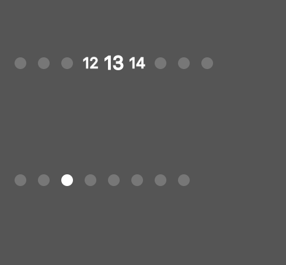

SWCustomPageControl
-----------------------
**version 0.1**  

**the sample to custom your pagecontrol**  
 
##Install    
drag all file in `/Class` folder into your project  
  
##Usage  
make a instance of **SWCustomPageControl**, then `setNumberOfPages` and `currentPage`  
to config actual size of page control, you can use `sizeForDots` to get the actual size of the instance.    
  
##License MIT